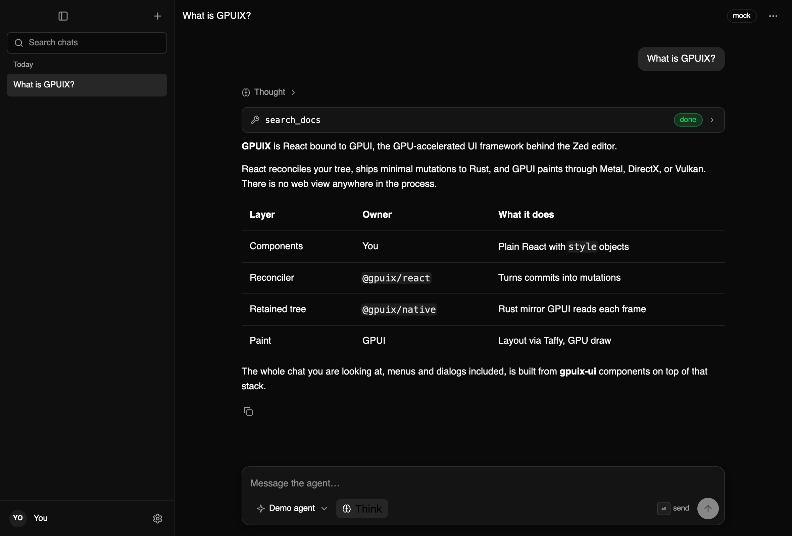

# gpuix-ui

shadcn-style components for [GPUIX](https://gpuix.dev), the React renderer for Zed's GPU-accelerated UI framework. Native windows, no web view, no CSS. Copy the source into your app or import it from a package.



Three layers, the same split as shadcn/ui:

| Package | Role | shadcn equivalent |
|---|---|---|
| `@gpuix-ui/core` | Theme tokens, `sv()` style variants, `sx()` merge, colour helpers | CSS variables + `cva` + `cn` |
| `@gpuix-ui/primitives` | Headless behaviour: Dialog, Popover, DropdownMenu, Tabs, Checkbox, Switch, RadioGroup, Collapsible | Radix |
| `@gpuix-ui/react` | Styled components, also published as a copy-paste registry | `components/ui/*` |

GPUIX already ships headless Select, Combobox, and Tooltip. gpuix-ui styles those and adds the primitives it is missing.

## Quick start

```bash
bunx @gpuix/cli new my-app && cd my-app
pnpm add @gpuix-ui/core @gpuix-ui/primitives @gpuix-ui/react
```

```tsx
import { render } from '@gpuix/react'
import { ThemeProvider, darkTheme } from '@gpuix-ui/core'
import { Button, Dialog, DialogContent, DialogHeader, DialogTitle, DialogTrigger, Text } from '@gpuix-ui/react'

function App() {
  return (
    <ThemeProvider theme={darkTheme}>
      <div style={{ width: '100%', height: '100%', padding: 24, backgroundColor: darkTheme.colors.background }}>
        <Dialog>
          <DialogTrigger asChild>
            <Button>Open</Button>
          </DialogTrigger>
          <DialogContent>
            <DialogHeader>
              <DialogTitle>Hello from the GPU</DialogTitle>
            </DialogHeader>
            <Text tone="muted">No web view was harmed.</Text>
          </DialogContent>
        </Dialog>
      </div>
    </ThemeProvider>
  )
}

render(<App />, { title: 'My App', width: 800, height: 600 })
```

Or copy the source in, shadcn style, and own it:

```bash
bunx gpuix-ui add button dialog dropdown-menu   # writes components/ui/*.tsx
bunx gpuix-ui add --all
```

The registry is plain JSON under [`r/`](./r) built from `packages/ui/src`, so a file you copied is the same file the package ships.

## Components

| Component | Notes |
|---|---|
| Text | The typographic base. `size`, `tone`, `weight`, `mono`, `truncate`. |
| Button | default, secondary, outline, ghost, destructive, link. `asChild` merges into a child. |
| Input, Textarea | Native GPUI editors with IME, selection, undo. Focus ring, leading/trailing slots. |
| Label, Badge, Kbd, Avatar, Separator, Skeleton, Progress, Spinner | Small pieces. |
| Card | Header, title, description, content, footer. |
| Alert | default, destructive, warning. |
| Tooltip | Over `@gpuix/react/tooltip`. |
| Select | Over `@gpuix/react/select`. Groups, labels, item descriptions, ghost chip variant. |
| DropdownMenu | Items, checkbox items, radio groups, labels, separators, shortcuts. Keyboard: arrows, Home, End, Enter, Escape. |
| Dialog, AlertDialog | Full-window overlay, centred or top-anchored panel, Escape and outside press. |
| Popover | Anchored floating panel. |
| Tabs | Segmented list, arrow-key navigation. |
| Switch, Checkbox, RadioGroup, Toggle, Collapsible | Controls. |
| ScrollArea | One native scroller. GPUI does not nest vertical scrollers. |

## Theming

A theme is a plain object with the same names as shadcn's CSS variables. Components read it from context, and every `<text>` they paint takes a colour from it, because GPUI does not inherit `color`.

```tsx
import { createTheme, darkTheme, ThemeProvider } from '@gpuix-ui/core'

const brand = createTheme(darkTheme, { colors: { primary: '#7C86FF', primaryForeground: '#0A0A0A' }, radius: { md: 8 } })

<ThemeProvider theme={brand}>...</ThemeProvider>
```

`toGpuixTheme(theme)` produces the native theme for `<markdown>`, `<code>`, `<diff>`, and inputs, so those match the rest of the window.

## Variants

`sv()` is `cva` for style objects. Variant values are styles, `hover` and `active` merge instead of replace, and the theme is closed over by a factory you memoise with `useVariants`.

```tsx
const chip = (t: Theme) =>
  sv({
    base: { display: 'flex', alignItems: 'center', height: 24, paddingLeft: 8, paddingRight: 8, borderRadius: t.radius.full },
    variants: {
      tone: {
        neutral: { backgroundColor: t.colors.secondary },
        danger: { backgroundColor: withAlpha(t.colors.destructive, 0.2) },
      },
    },
    defaultVariants: { tone: 'neutral' },
  })

function Chip({ tone, children }) {
  const styles = useVariants(chip)
  const t = useTheme()
  return <div style={styles({ tone })}><Text size="xs">{children}</Text></div>
}
```

## Example: agent chat

[`examples/chat`](./examples/chat) is a full chat app: sidebar with search and per-row menus, transcript in a `<virtual-list>` with native markdown, thinking folds and tool cards, a composer with a model picker, a settings dialog with tabs, rename and delete dialogs, light and dark themes. A mock agent streams canned answers; set `ANTHROPIC_API_KEY` and pick a Claude model to stream from the Claude API through the official SDK.

```bash
pnpm install
pnpm chat                         # bun --hot examples/chat/app.tsx
pnpm --filter @gpuix-ui/example-chat test
```

## How the primitives work on GPUI

- **Overlays** render into `<anchored deferred>`, which GPUI paints in a later pass over everything, including virtual lists. Dialog uses `position: {x: 0, y: 0}`, which is window-absolute, so no portal is needed.
- **Dismissal** uses `onMouseDownOutside`. GPUI does not bubble mouse events, so a backdrop `onMouseDown` cannot see a press that landed on the panel.
- **Keyboard** goes through native focus: content panels are `tabIndex={0}` with `autoFocus`, and focus returns to the trigger on close through `renderer.focusElement`.
- **Item registries** (menus, tabs, radios) register in mount order, so arrow keys work without the parent inspecting its children.

## Development

```bash
pnpm install
pnpm typecheck
pnpm test              # GPU test renderer, offscreen, no window
pnpm registry:build    # regenerate registry.json and r/
```

Tests use `createTestRoot()` from `@gpuix/react/testing`: they lay out and paint through real GPUI, click by painted bounds, and screenshot into `screenshots/`.

## Status

Early. Built against `@gpuix/react` 0.7. macOS is exercised; Windows and Linux are untested. See [AGENTS.md](./AGENTS.md) for the rules an agent should follow when building with or on this library.

MIT
